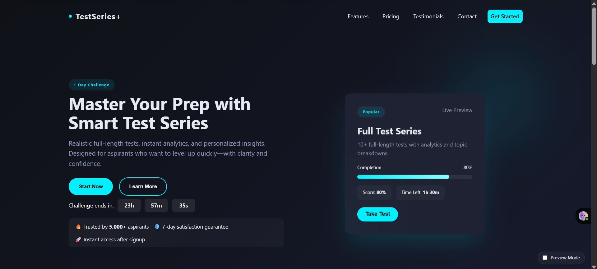

# 🎯 Test Series Page - Dark Theme Redesign

A modern, fully responsive **Test Series** landing page redesigned in **dark theme** as part of a **1-day internship challenge**.  
Built with only **HTML, CSS, and JavaScript** — no frameworks or libraries.

---

## 📸 Preview

  

---

## 🚀 Features

- **Dark Mode Design** with neon highlight color `#00f0ff`
- **Hero Section** with title, subtitle, and call-to-action button
- **Test Series Features** (6 feature cards with hover effects)
- **Pricing CTA** with scroll anchor
- **Responsive Layout** for desktop, tablet, and mobile
- **Smooth hover effects** & transitions
- **Internal single-file structure** for easy deployment

---

## 🌟 Extra Features (Bonus)

- **Preview Mode Toggle** — Switch to a light sketch overlay with one click (pure CSS)
- **Animated Progress Bar** — Displays simulated test completion
- **Countdown Timer** — Shows challenge deadline urgency
- **Motion Preference Respect** — Subtle animations disabled for users who prefer reduced motion

---

## 🛠️ Tech Stack

- **HTML5**
- **CSS3** (Internal `<style>` tag)
- **JavaScript** (Internal `<script>` tag)

---

